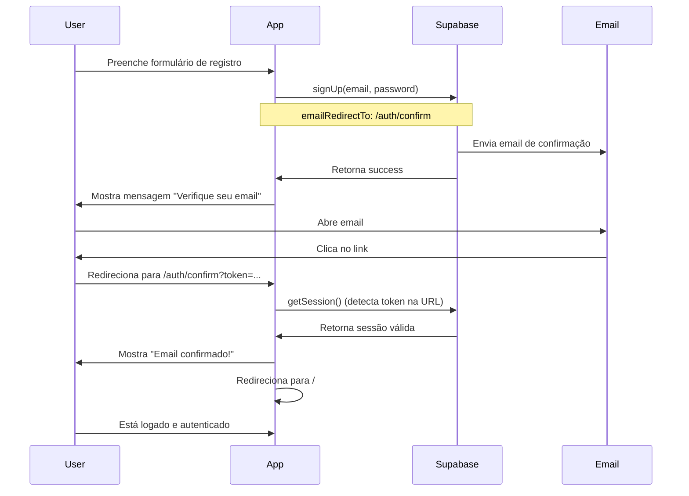

# Solução: Email de Validação de Conta

## ✅ Alterações Implementadas

### 1. Criada Página de Confirmação de Email

**Arquivo**: `src/pages/auth/ConfirmEmailPage.tsx`

- Página dedicada para processar a confirmação de email
- Detecta automaticamente o token na URL usando `supabase.auth.getSession()`
- Exibe feedback visual (loading, success, error)
- Redireciona automaticamente para o dashboard após sucesso
- Inclui logs detalhados para debug

### 2. Rota Adicionada no App.tsx

**Nova rota**: `/auth/confirm`

```typescript
<Route path="/auth/confirm" element={
  <PublicRoute allowAuthenticated>
    <ConfirmEmailPage />
  </PublicRoute>
} />
```

### 3. useAuth.tsx Atualizado

**Alterações**:
- URL de redirecionamento mudada de `/` para `/auth/confirm`
- Adicionados logs de debug detalhados
- Logs incluem informações sobre ambiente (produção vs desenvolvimento)

```typescript
const redirectUrl = getRedirectUrl('/auth/confirm');
console.log('📧 [Auth] SignUp - Email:', email, '| Redirect URL:', redirectUrl);
```

## 🔧 Configuração Necessária no Supabase

Para que o email de validação funcione corretamente, você **DEVE** configurar as URLs no painel do Supabase:

### 1. Acesse o Dashboard

URL: https://supabase.com/dashboard/project/yfyousmorhjgoclxidwm/auth/url-configuration

### 2. Configure a Site URL

```
Site URL: https://deamanager.lovable.app
```

### 3. Adicione as Redirect URLs

Adicione AMBAS as URLs abaixo na lista de "Redirect URLs":

```
https://deamanager.lovable.app/auth/confirm
https://deamanager.lovable.app/**
http://localhost:5173/auth/confirm
http://localhost:5173/**
```

**Importante**: O `**` é um wildcard que permite qualquer caminho após a URL base.

### 4. Verifique a Configuração de Email

1. Acesse: https://supabase.com/dashboard/project/yfyousmorhjgoclxidwm/auth/providers
2. Clique em "Email"
3. Verifique se "Confirm email" está **HABILITADO** ✅
4. Se estiver desabilitado, habilite-o

### 5. (Opcional) Verifique o Template de Email

1. Acesse: https://supabase.com/dashboard/project/yfyousmorhjgoclxidwm/auth/templates
2. Selecione "Confirm signup"
3. Verifique se o template contém: `{{ .ConfirmationURL }}`

## 🧪 Como Testar

### Teste Local (Desenvolvimento)

1. Inicie o servidor:
   ```bash
   npm run dev
   ```

2. Acesse: http://localhost:5173/auth/register

3. Registre uma nova conta com um email válido

4. Verifique o console do navegador (F12) para logs:
   ```
   🔗 [Auth] Redirect URL: { isProduction: false, url: 'http://localhost:5173/auth/confirm', ... }
   📧 [Auth] SignUp - Email: teste@email.com | Redirect URL: http://localhost:5173/auth/confirm
   ✅ [Auth] SignUp - Success! Check email for confirmation.
   ```

5. Verifique sua caixa de email (incluindo spam)

6. Clique no link de confirmação

7. Você deve ser redirecionado para: http://localhost:5173/auth/confirm

8. A página deve mostrar:
   - Loading → Success → Redirecionamento automático

### Teste em Produção

1. Acesse: https://deamanager.lovable.app/auth/register

2. Registre uma nova conta

3. Verifique o email

4. Clique no link de confirmação

5. Você deve ser redirecionado para: https://deamanager.lovable.app/auth/confirm

6. Login deve funcionar normalmente após confirmação

## 🔍 Debug e Troubleshooting

### Problema: Email não chega

**Verificações**:
1. Verifique a pasta de spam
2. Verifique os logs do Supabase:
   - URL: https://supabase.com/dashboard/project/yfyousmorhjgoclxidwm/logs/explorer
   - Filtre por: "auth" e "email"
3. Verifique rate limiting (planos gratuitos têm limites)

**Logs do navegador devem mostrar**:
```
✅ [Auth] SignUp - Success! Check email for confirmation.
emailConfirmationSent: true
```

### Problema: Link de confirmação retorna erro

**Verificações**:
1. Verifique se as Redirect URLs estão configuradas no Supabase
2. Verifique o console do navegador para erros
3. O link expira após algumas horas

**Logs esperados na página de confirmação**:
```
🔍 [ConfirmEmail] Iniciando verificação de confirmação de email
📧 [ConfirmEmail] Sessão obtida: { hasSession: true, error: undefined }
✅ [ConfirmEmail] Email confirmado com sucesso!
🔀 [ConfirmEmail] Redirecionando para dashboard
```

### Problema: Redirect URL incorreta

**Verificação**:
1. Abra o console do navegador (F12)
2. Faça signup
3. Procure por logs começando com `🔗 [Auth] Redirect URL:`
4. Verifique se a URL está correta para o seu ambiente

**Ambiente Local deve mostrar**:
```
isProduction: false
url: 'http://localhost:5173/auth/confirm'
```

**Ambiente Produção deve mostrar**:
```
isProduction: true
url: 'https://deamanager.lovable.app/auth/confirm'
```

### Problema: Confirmação funciona mas não loga

**Causa**: `detectSessionInUrl: true` deve capturar o token automaticamente.

**Verificação**:
1. Verifique `src/integrations/supabase/client.ts`
2. Confirme que está configurado:
   ```typescript
   auth: {
     detectSessionInUrl: true,
     flowType: 'pkce'
   }
   ```

## 📊 Fluxo Completo



## 📝 Checklist de Configuração

Use este checklist para garantir que tudo está configurado:

- [ ] ✅ Página `ConfirmEmailPage.tsx` criada
- [ ] ✅ Rota `/auth/confirm` adicionada no `App.tsx`
- [ ] ✅ `useAuth.tsx` atualizado com logs e nova redirect URL
- [ ] ⚠️ **Site URL** configurada no Supabase Dashboard
- [ ] ⚠️ **Redirect URLs** adicionadas no Supabase Dashboard (produção + local)
- [ ] ⚠️ **Confirm email** habilitado no Supabase
- [ ] ⚠️ Testar registro de nova conta
- [ ] ⚠️ Testar recebimento do email
- [ ] ⚠️ Testar clique no link de confirmação
- [ ] ⚠️ Verificar logs do navegador
- [ ] ⚠️ Verificar logs do Supabase (se houver problemas)

**Legenda**:
- ✅ = Já implementado no código
- ⚠️ = Requer ação manual no Dashboard do Supabase ou teste

## 🎯 Próximos Passos

1. **IMEDIATO**: Configure as URLs no Dashboard do Supabase
   - Acesse: https://supabase.com/dashboard/project/yfyousmorhjgoclxidwm/auth/url-configuration
   - Configure Site URL e Redirect URLs conforme descrito acima

2. **TESTE**: Registre uma nova conta e teste o fluxo completo

3. **VERIFICAR**: Se o problema persistir:
   - Verifique os logs do navegador (console)
   - Verifique os logs do Supabase
   - Verifique se o email foi enviado (pode demorar alguns minutos)

4. **OPCIONAL**: Se quiser desabilitar a confirmação de email para facilitar o desenvolvimento:
   - Acesse: https://supabase.com/dashboard/project/yfyousmorhjgoclxidwm/auth/providers
   - Desabilite "Confirm email"
   - Usuários poderão fazer login imediatamente após registro

## 📚 Referências

- [Supabase Email Auth](https://supabase.com/docs/guides/auth/auth-email)
- [Supabase URL Configuration](https://supabase.com/docs/guides/auth/redirect-urls)
- [PKCE Flow](https://supabase.com/docs/guides/auth/auth-code-flow)

---

**Data**: 2025-11-11  
**Status**: ✅ Código implementado, ⚠️ Requer configuração manual no Supabase
