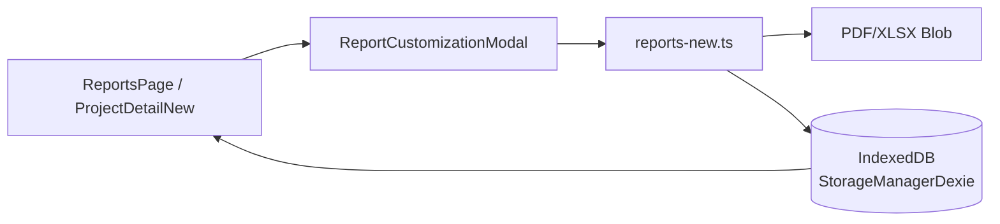

# Arquitetura do Sistema de Relatórios

## 1. Estrutura

### Visão geral do sistema de relatórios
Os relatórios de projetos são compostos por três camadas principais:

1. **UI de listagem e acionamento** – A página `ReportsPage` consolida dados de projetos e instalações para análises rápidas e exportação CSV direta.【F:src/pages/ReportsPage.tsx†L24-L150】  
2. **UI de customização contextual** – O modal `ReportCustomizationModal` permite ajustar seções, agrupamentos e detalhes adicionais antes de gerar ou compartilhar relatórios PDF/XLSX.【F:src/components/reports/ReportCustomizationModal.tsx†L31-L200】  
3. **Serviços de geração** – O módulo `reports-new.ts` centraliza cálculos de seções, sumarizações e a renderização final em PDF (jsPDF) ou XLSX (SheetJS), aplicando estratégias de tolerância a falhas e otimização de mídia.【F:src/lib/reports-new.ts†L10-L520】【F:src/lib/reports-new.ts†L1652-L1758】

### Fluxo de dados (UI → Service → PDF/XLSX)
1. O usuário acessa a aba *Relatórios* em `ProjectDetailNew` e aciona o modal de customização (`ReportCustomizationModal`).【F:src/pages/ProjectDetailNew.tsx†L1050-L1091】  
2. O modal calcula prévias com `calculateReportSections`/`calculatePavimentoSummary` para validar escolhas antes da geração.【F:src/components/reports/ReportCustomizationModal.tsx†L111-L158】  
3. Ao confirmar, o modal delega ao serviço `reports-new.ts`, enviando projeto, instalações, versões e `ReportConfig` selecionados. O serviço retorna um `Blob` PDF ou XLSX pronto para download/compartilhamento.【F:src/pages/ProjectDetailNew.tsx†L1054-L1079】【F:src/lib/reports-new.ts†L383-L520】【F:src/lib/reports-new.ts†L1652-L1758】  
4. Opcionalmente, o resultado é persistido no histórico local via `StorageManagerDexie` para consulta futura.【F:src/services/storage/StorageManagerDexie.ts†L720-L759】

### Diagrama Mermaid


## 2. Componentes

### ReportsPage
Responsabilidades principais:
- Agregar projetos e instalações a partir do `storage` local, exibindo métricas chave (total de projetos, pendências, progresso médio).【F:src/pages/ReportsPage.tsx†L35-L88】
- Disponibilizar filtro por projeto e exportação rápida em CSV, com tratamento de erros via `errorMonitoring` e feedback de toast.【F:src/pages/ReportsPage.tsx†L90-L150】
- Servir como entrada simplificada para relatórios de alto nível, distinta da geração avançada dentro da tela de projeto.

### ReportCustomizationModal
Funcionalidades:
- Persistir preferências do usuário em `localStorage` (via chave `report-config-preferences`).【F:src/components/reports/ReportCustomizationModal.tsx†L89-L109】
- Calcular pré-visualizações de seções e sumarizações com debounce de 300 ms para evitar recomputações excessivas enquanto o usuário ajusta opções.【F:src/components/reports/ReportCustomizationModal.tsx†L111-L158】
- Garantir que ao menos uma seção seja selecionada e expor atalhos para restaurar padrões ou alternar detalhes (fotos, observações, comentários de fornecedor, timestamps, sumário por pavimento, gráfico de armazenamento).【F:src/components/reports/ReportCustomizationModal.tsx†L161-L200】
- Disparar geração/compartilhamento em PDF ou XLSX, controlando estado de carregamento para feedback visual.

### reports-new.ts
Principais responsabilidades:
- Definir contratos `ReportData`, `ReportSections` e `PavimentoSummary`, além de tema de estilização compartilhado entre PDF e XLSX.【F:src/lib/reports-new.ts†L10-L61】
- Calcular seções (`pendencias`, `concluidas`, `emRevisao`, `emAndamento`) respeitando o interlocutor selecionado (cliente ou fornecedor).【F:src/lib/reports-new.ts†L63-L95】
- Gerar sumário por pavimento com ordenação natural, utilizado tanto no PDF quanto no XLSX.【F:src/lib/reports-new.ts†L97-L128】
- Renderizar PDFs com jsPDF, autoTable e recursos auxiliares (logo, gráfico de barra, links de fotos), adotando *try/catch* específicos para que falhas não bloqueiem o relatório completo.【F:src/lib/reports-new.ts†L368-L520】
- Criar planilhas XLSX com abas de resumo, pavimento e seções específicas, além de notas para células de fotos e rótulos adaptados ao interlocutor.【F:src/lib/reports-new.ts†L1652-L1758】
- Otimizar upload/processamento de fotos com lote de 5 itens e galerias HTML hospedadas no Supabase, mantendo o fluxo resiliente caso partes falhem.【F:src/lib/reports-new.ts†L902-L980】

## 3. Configuração

### ReportConfig
```ts
interface ReportConfig {
  interlocutor: 'cliente' | 'fornecedor';
  sections: {
    pendencias: boolean;
    concluidas: boolean;
    emRevisao: boolean;
    emAndamento: boolean;
  };
  includeDetails: {
    photos: boolean;
    observations: boolean;
    supplierComments: boolean;
    timestamps: boolean;
    pavimentoSummary: boolean;
    storageChart: boolean;
  };
  groupBy: 'none' | 'pavimento' | 'tipologia';
  sortBy: 'codigo' | 'pavimento' | 'tipologia' | 'updated_at';
}
```
Cada propriedade está disponível no modal e é armazenada em `localStorage`, permitindo reutilização das preferências na próxima sessão.【F:src/components/reports/ReportCustomizationModal.tsx†L31-L109】 As escolhas influenciam diretamente filtros e colunas no PDF/XLSX.

### ReportSections e cálculo
`calculateReportSections` classifica cada instalação em quatro coleções, priorizando itens em revisão (`revisao > 1`), depois avaliando pendências com base em campos de observação/comentários e na flag `pendencia_tipo`. Itens restantes são marcados como concluídos ou em andamento conforme `installed`.【F:src/lib/reports-new.ts†L63-L95】 Essas seções alimentam tanto as tabelas planas quanto as agregações por pavimento/tipologia.

### Diferenças cliente × fornecedor
- Para interlocutores **cliente**, pendências consideram apenas observações do campo do cliente; para **fornecedor**, também incluem `comentarios_fornecedor`.【F:src/lib/reports-new.ts†L79-L83】
- As abas/colunas de status em XLSX adaptam rótulos (por exemplo, "Em Andamento" vs. "Aguardando Instalação").【F:src/lib/reports-new.ts†L1683-L1688】【F:src/lib/reports-new.ts†L1752-L1755】
- O modal expõe opções adicionais (comentários de fornecedor) quando o interlocutor muda, guiando os detalhes incluídos em cada exportação.【F:src/components/reports/ReportCustomizationModal.tsx†L39-L48】

## 4. Troubleshooting

### Problemas comuns e soluções
- **Dados vazios ou inconsistentes**: verifique se `storage.getProjects()` e `storage.getInstallationsByProject` retornam registros; erros são capturados e enviados ao `errorMonitoring` com severidade "high" para facilitar rastreamento.【F:src/pages/ReportsPage.tsx†L35-L59】
- **Falhas em uploads de fotos**: o serviço registra erros detalhados e continua com itens restantes; uma galeria vazia apenas remove links clicáveis sem quebrar o relatório.【F:src/lib/reports-new.ts†L904-L980】【F:src/lib/reports-new.ts†L711-L741】
- **Erros no PDF/XLSX**: `generatePDFReport` e `generateXLSXReport` validam entradas e retornam blobs vazios em falhas críticas, registrando mensagens no console para investigação rápida.【F:src/lib/reports-new.ts†L368-L401】【F:src/lib/reports-new.ts†L1652-L1668】

### Como debugar erros de geração
1. Reproduza o cenário com `VERBOSE_LOGS` ativado para obter stack traces completos no `errorMonitoring`/`logger`.
2. Consulte `errorMonitoring.getErrorStats()` para verificar frequência, severidade e contexto (URL, userAgent).【F:src/services/errorMonitoring.ts†L62-L199】
3. Use `logger.getRecentLogs()` para extrair histórico dos últimos eventos e exportá-los se necessário.【F:src/services/logger.ts†L14-L175】
4. Se suspeitar de mídia, confirme URLs retornados por `supabase.storage.getPublicUrl` e revise batch uploads em `uploadPhotosForReport`.

### Logs e métricas disponíveis
- **ErrorMonitoring**: mantém mapa de até 1000 erros, conta ocorrências e expõe estatísticas para dashboards internos.【F:src/services/errorMonitoring.ts†L25-L199】
- **Logger**: controla nível de log (verbose/normal/minimal), registra até 100 entradas recentes e permite exportação JSON para suporte técnico.【F:src/services/logger.ts†L14-L175】
- **Histórico de relatórios**: `StorageManagerDexie` armazena metadados e blobs (quando disponíveis), permitindo auditoria dos últimos 20 relatórios por projeto.【F:src/services/storage/StorageManagerDexie.ts†L720-L755】

## 5. Performance

### Otimizações implementadas
- Debounce na atualização de prévias do modal para evitar renderizações repetidas enquanto o usuário ajusta filtros.【F:src/components/reports/ReportCustomizationModal.tsx†L150-L158】
- Processamento de uploads de fotos em lotes de 5 com retry exponencial, reduzindo saturação de rede e garantindo recuperação de falhas parciais.【F:src/lib/reports-new.ts†L902-L980】
- Geração de gráficos e tabelas com *lazy failure*: se logo, gráfico ou fotos falharem, o PDF continua sendo produzido sem travar o fluxo.【F:src/lib/reports-new.ts†L383-L520】

### Limites e capacidades
- O histórico local mantém os 20 relatórios mais recentes por projeto; exportações adicionais substituem as mais antigas para preservar espaço em IndexedDB.【F:src/services/storage/StorageManagerDexie.ts†L745-L755】
- O pipeline de fotos não impõe um limite rígido, mas uploads acima de lotes de 5 são encadeados em múltiplos ciclos; monitorar tempo de geração caso cada instalação possua muitas fotos.【F:src/lib/reports-new.ts†L902-L980】
- As planilhas e PDFs suportam qualquer número de instalações, porém considere segmentar projetos extremamente grandes para manter tamanho final manejável.

### Boas práticas de uso
- Selecione apenas seções necessárias para reduzir tamanho de arquivo e tempo de renderização, especialmente quando incluir fotos em massa.
- Prefira agrupar por `pavimento` (padrão) para manter tabelas agregadas menores; use `tipologia` apenas quando necessário para análises detalhadas.
- Habilite logs em ambientes de homologação ao introduzir novos campos/colunas para capturar regressões rapidamente.
- Revise periodicamente o histórico de relatórios e limpe entradas antigas via `StorageManagerDexie.deleteReport` quando não forem mais necessárias.【F:src/services/storage/StorageManagerDexie.ts†L766-L778】

